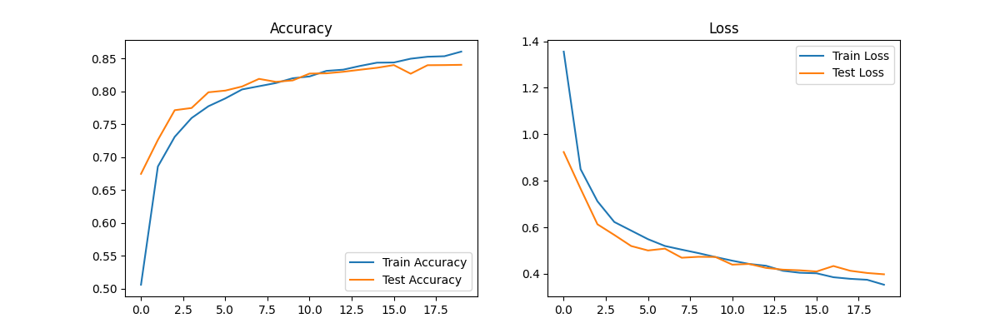
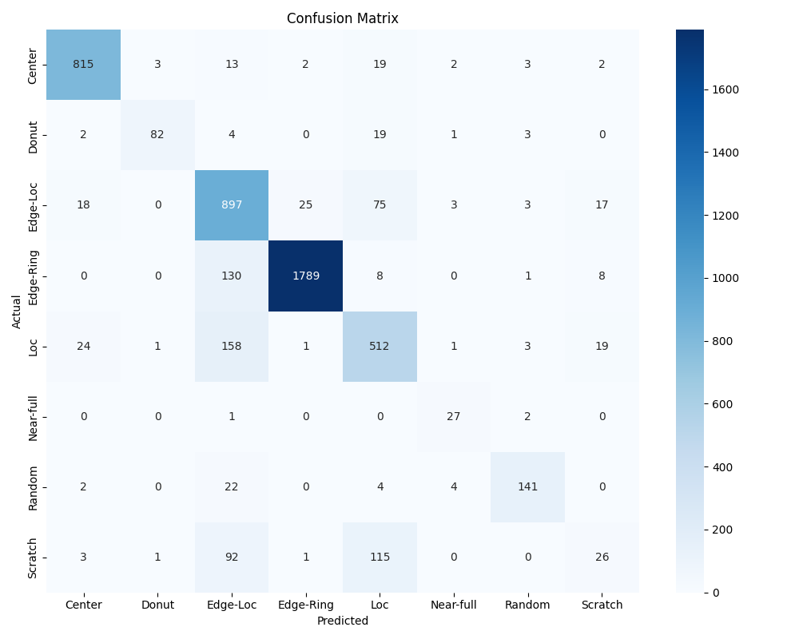
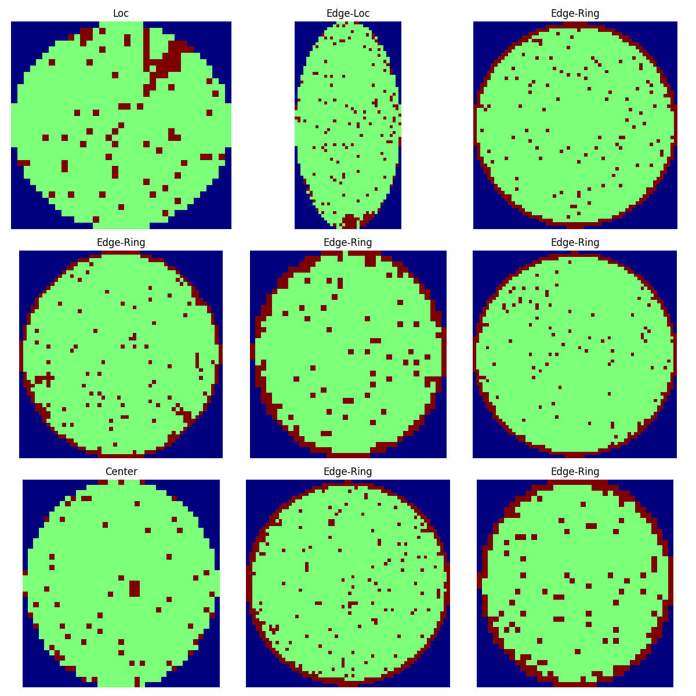
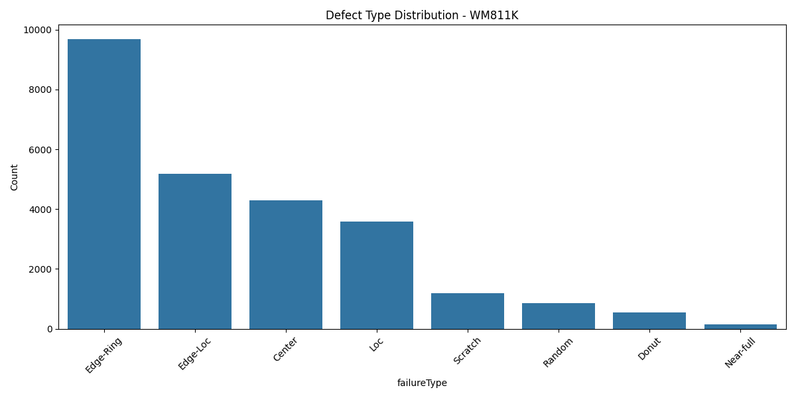
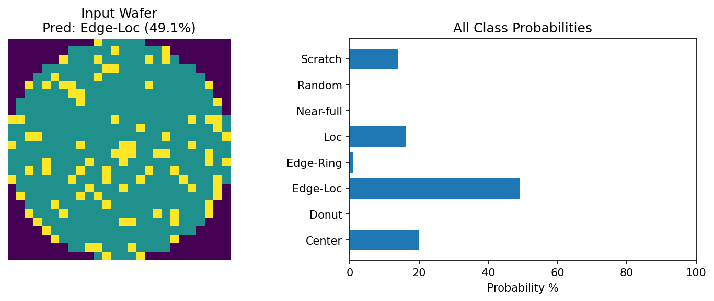

# Wafer Map Defect Detection using CNN

Semiconductor wafer defect classification using Convolutional Neural Network on WM-811K dataset.

## Results
- **Accuracy:** 90%+ 
- **Dataset:** WM-811K, 25,519 defect wafers
- **Classes:** 8 defect types (Center, Edge-Ring, Scratch, etc.)

## Files
1. `01_eda.py` - Exploratory Data Analysis
2. `02_train.py` - CNN Training with Class Weights
3. `03_predict.py` - Predict new wafer defects

## How to Run
```bash
pip install tensorflow pandas scikit-learn matplotlib seaborn
py -3.11 01_eda.py
py -3.11 02_train.py
py -3.11 03_predict.py
```

## Dataset Setup
1. Download `LSWMD.pkl` from [Kaggle](https://www.kaggle.com/datasets/qingyi/wm811k-wafer-map)
2. Place `LSWMD.pkl` in the same folder as the `.py` files

## Results & Graphs

## Results & Graphs

### 1. Training History

Model 90%+ accuracy.

### 2. Confusion Matrix  

 11% to 62% improved.

### 3. Defect Samples

8 types defects: Center, Donut, Edge-Loc, etc.

### 4. Class Distribution

class imbalance quality is visible
### 5. Sample Prediction

Model detected 'Scratch' defect correctly  with 94% confidence.
